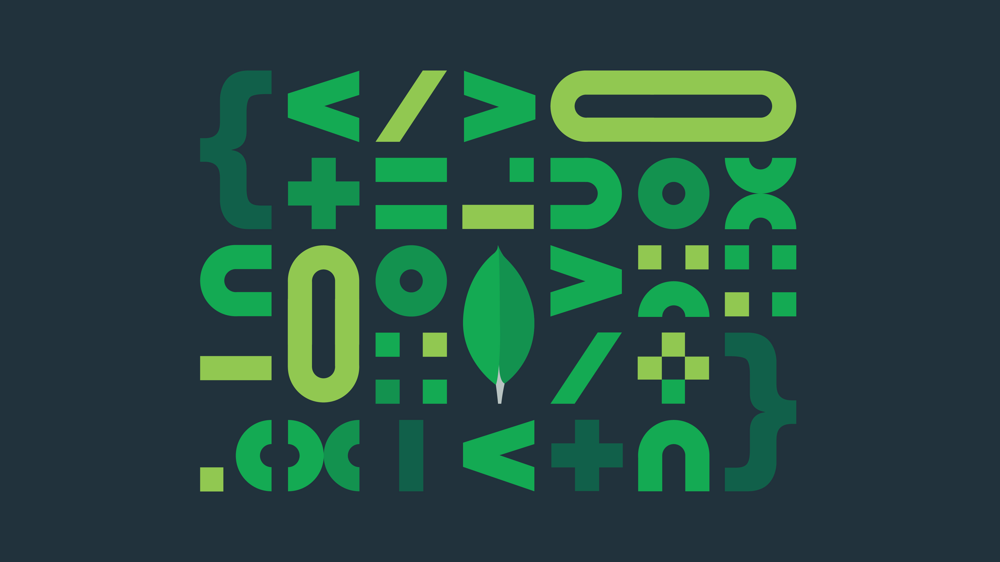

# About me
I am very excited about learning Data Science since 2021. 

I'm currently working as a Software Engineering Manager, specialized in delivering web applications using Agile methodologies in last 5 years. 

I've worked extensively in developing Video Control plane and Consumer electronics applications for 11+ years before starting to manage projects.

# My Portfolio
---
## Full stack App(s)
### Project 1

POC of stack overflow like application using mongo db.  

---

## Machine Learning
### Project 1

Credit card Fraud detection POC   

